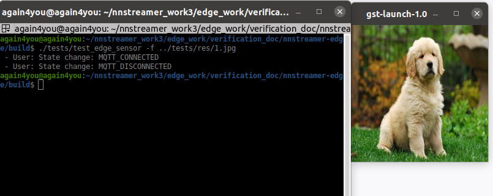
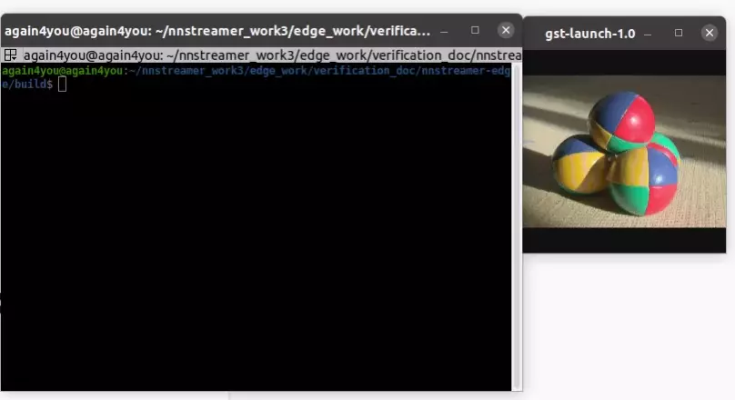

# nnstreamer-edge-sensor

`nnstreamer-edge-sensor` is a utility library for publishing any type of data as an MQTT message.
Without GStreamer dependencies, it can provide remote nodes with stream input data such as camera image, temperature, or humidity. 
`mqttsrc` element of NNStreamer can access these data and exploit them on pipeline stream.

`nnstreamer-edge-sensor` is designed not to depend on GStreamer/GLib so targets to be adopted by general RTOS or Lightweight devices.


## Getting Started

### Prerequisites

To build `nnstreamer-edge-sensor` in the Ubuntu/Debian environment, the following packages are needed.

```bash
$ sudo apt install cmake libpaho-mqtt-dev libpaho-mqtt1.3 mosquitto mosquitto-clients
```

### How to build

When building `nnstreamer-edge-sensor`, you can set the version number of nnstreamer-edge-sensor or enable test program.
In this example, the test program is enabled for a future test. (`-DENABLE_TEST=ON`)

```bash
$ git clone https://github.com/nnstreamer/nnstreamer-edge.git
$ cd nnstreamer-edge
$ mkdir build
$ cd build
...
# In this example, test is enabled.
$ cmake .. -DCMAKE_INSTALL_PREFIX=/usr -DENABLE_TEST=ON
$ make
```

Note that, to install the built library, you need the `root` permission. You can make an rpm or debian package and install it.


## How to use

`nnstreamer-edge-sensor` provides a devel package and it contains `pkg-config` file. So you can use it when building your own program.

```bash
$ pkg-config --libs nnstreamer-edge-sensor
-L -lnnstreamer-edge-sensor
```

## How to test

In this example, we publish a jpeg image as `TestTopic` name on the client-side. On the server-side, we subscribe to the `TestTopic` and show received images.

### Check the mqttsrc and mqttsink are available

Before executing the server script, you have to check the `mqttsrc` and `mqttsink` are available as below.

```bash
$ gst-inspect-1.0 --gst-plugin-path="build" | grep mqtt
mqtt:  mqttsink: MQTT sink
mqtt:  mqttsrc: MQTT source
```

If `mqtt` element is not available in your environment, you can build the NNStreamer from the source code after enabling the mqtt-support option.

```bash
$ git clone https://github.com/nnstreamer/nnstreamer.git
$ cd nnstreamer

# Enable the mqtt-support option as below
# meson_options.txt
# +option('mqtt-support', type: 'feature', value: 'enabled')

$ meson build
$ ninja -C build

# If you want to install, add `install` option as below
$ ninja -C build install
```

### Server side

With `mqttsrc` element, the below command subscribes `TestTopic` message which contains one jpeg image. If the message is received, then it is shown on the screen. In this example, we built the nnstreamer in the `build` directory so we use `--gst-plugin-path` option to set the mqtt plugin path.

```bash
$ gst-launch-1.0 --gst-plugin-path="build" mqttsrc debug=1 sub-topic=TestTopic host=localhost sub-timeout=9223372036854775807 ! jpegdec ! video/x-raw,framerate=0/1 ! videoscale ! videoconvert ! ximagesink qos=0
```

### Publish single data

If you want to publish a single jpeg file, you can use `-f [file_path]` option. Then the received image is shown on another window.

```bash
$ pwd
[your_home]/nnstreamer-edge/build
$ ./tests/test_edge_sensor
Usage: ./tests/test_edge_sensor [-f jpeg_file] [-d directory] [-c count]
$ ./tests/test_edge_sensor -f ../tests/res/1.jpg
```



### Publish multiple data
If you want to publish multiple jpeg files, you can use `[-d directory] [-c count]` options.
As soon as the topic is received, the image is shown as below.

```bash
$ pwd
[your_home]/nnstreamer-edge/build
$ ./tests/test_edge_sensor -d ../tests/res -c 10
```

